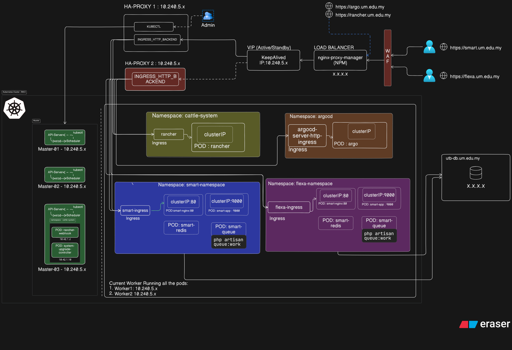

# RKE2 HA Setup 2026
# RKE2 High Availability Cluster Setup

This repository documents my experience deploying a High Availability Kubernetes cluster using RKE2.

## Overview

- Kubernetes Distribution: RKE2
- Cluster Type: High Availability
- Nodes: 3 Control Plane + 2 Worker Nodes
- OS: Rocky Linux 8.10 (For master and worker nodes)
- OS: Ubuntu 22.04 (For haproxy nodes)
- Container Runtime: containerd

## Architecture

Control Plane Nodes:
- cp1 (192.168.1.10)
- cp2 (192.168.1.11)
- cp3 (192.168.1.12)

Worker Nodes:
- worker1 (192.168.1.20)
- worker2 (192.168.1.21)

Load Balancer:
- HAProxy + Keepalived

VIP:
192.168.1.100

## Cluster Diagram

## Prerequisites

- Linux servers
- SSH access
- Disable swap
- Required ports open

## Installation

### Install RKE2 Server

curl -sfL https://get.rke2.io | sh -

Enable service:

systemctl enable rke2-server
systemctl start rke2-server

### Install Worker Node

curl -sfL https://get.rke2.io | INSTALL_RKE2_TYPE="agent" sh -

## Verify Cluster

kubectl get nodes

## Troubleshooting

### Worker Node Cannot Join

Check firewall:

ufw allow 9345/tcp
ufw allow 6443/tcp

### Node Not Ready

Check logs:

journalctl -u rke2-server -f

## Future Improvements

- Install MetalLB
- Install Longhorn Storage
- Setup Velero Backup
